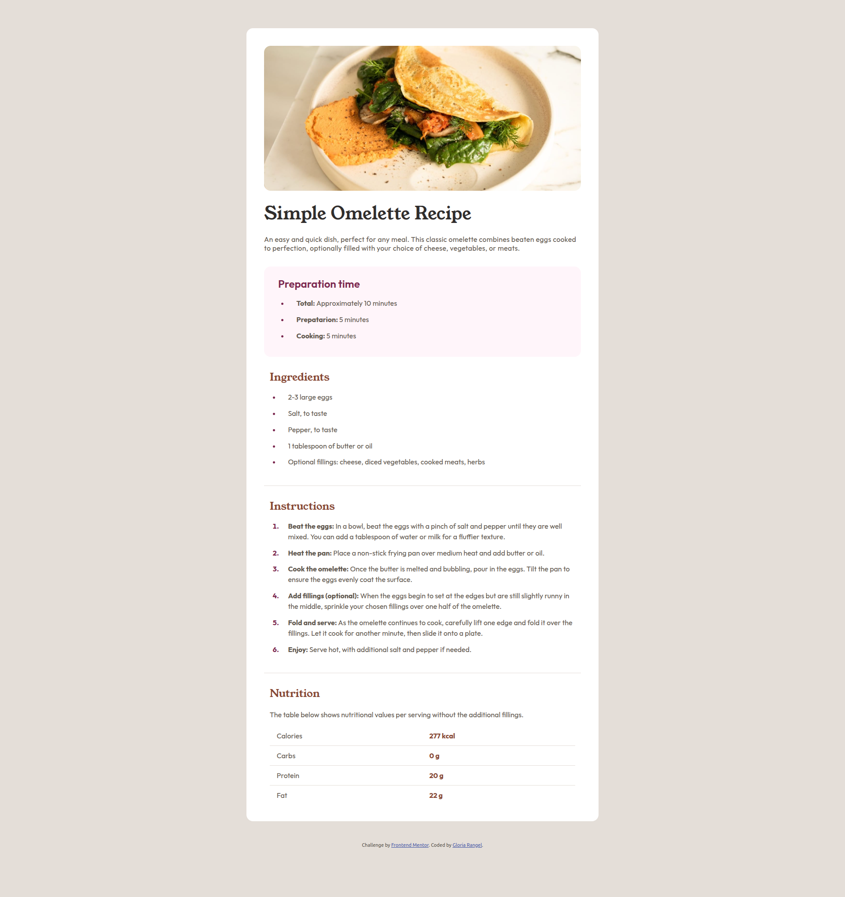
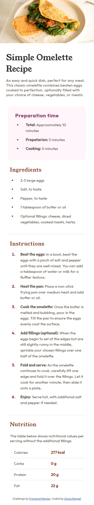

# 🖼 Frontend Mentor - Recipe page solution

This is a solution to the [Recipe page challenge on Frontend Mentor](https://www.frontendmentor.io/challenges/recipe-page-KiTsR8QQKm). Frontend Mentor challenges help you improve your coding skills by building realistic projects. 

## 📋 Table of contents

- Overview
- Screenshot
- Links
- My process
- Built with
- Useful resources
- Author
- Thanks

## 📖 Overview
This project focuses on creating a fully responsive recipe page with semantic HTML and clean CSS. The challenge requires careful consideration of appropriate HTML elements for each section to ensure the content is structured and accessible. The final design should closely match the provided design mockup, while adhering to best practices for semantic coding.

It’s a great opportunity to practice:

- Writing semantic HTML that improves accessibility.
- Structuring content in a meaningful way using elements like <header>, <main>, <section>, <article>, and <footer>.
- Building responsive designs with CSS to ensure the page looks great on various screen sizes.

### 📸 Screenshot
These are the screenshots of the implemented solution:

- **🖥️ Desktop version**  
  

- **📱 Mobile version**  
  

### ⛓️ Links

- HTML URL: [index.html](https://github.com/NorimNori/recipe-page/blob/main/index.html)
- CSS URL: [styles.css](https://github.com/NorimNori/recipe-page/blob/main/styles.css)
- Live Site URL: [on Netlify](https://recipe-page-by-gr.netlify.app/)

## 📌 My process

### 🪚 Built with

- Semantic HTML5 markup
- CSS custom properties
- Flexbox
- CSS Grid
- Mobile-first workflow

### 🔬 What I learned

This project helped me reinforce the importance of semantic HTML and the correct application of CSS styles to both ordered and unordered lists. I learned how to style the markers and the text separately, ensuring they each have distinct appearances while maintaining proper spacing for a clean and organized layout.

### 📝 Useful resources

- [CSS Tables](https://www.w3schools.com/css/css_table.asp) - This article helps you customize and style tables in CSS to enhance their appearance, including borders, spacing, and alignment for a more professional and visually appealing layout.

- [CSS Lists](https://www.w3schools.com/css/css_list.asp) - This article helps you customize and style the markers in ordered (<ol>) and unordered (<ul>) lists for a more visually appealing design.

## 👋 Author

- LinkedIn - [Gloria Rangel](https://www.linkedin.com/in/gloria-rangel-06b960306/)
- Frontend Mentor - [@NorimNori](https://www.frontendmentor.io/profile/NorimNori)

## 🌟 Thank You 🌟
Thanks for visiting this repository! I hope you found it useful and inspiring, or it was just a fun time.  

A special thanks to [Frontend Mentor](https://www.frontendmentor.io) for the challenge and for being such an amazing platform to learn and grow as a developer.  

Have a nice day! 😊
